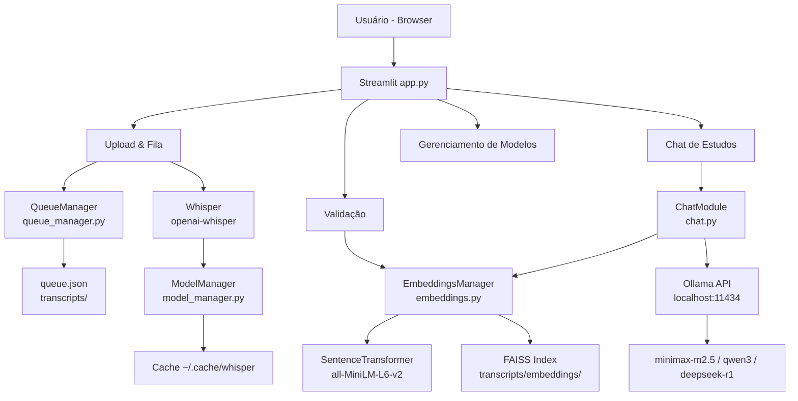

# Transcritor Pro

Aplicação web para transcrição automática de áudio e vídeo com fila de execução, gerenciamento de modelos, validação de transcrições e chat de estudos com IA conversacional.

Construída com **OpenAI Whisper**, **FAISS**, **Sentence Transformers** e **Ollama** — funciona 100% local, sem custo e sem dependência de APIs externas.

---

## Funcionalidades

### Upload & Fila de Execução

- Upload de múltiplos arquivos de áudio e vídeo (mp4, mp3, wav, m4a, ogg, flac, avi, mkv)
- Suporte a arquivos de até **2 GB**
- Fila de jobs com status em tempo real: pendente → processando → validando → concluído → vetorizado
- **Retry com troca de modelo**: jobs com erro exibem o detalhe do erro, seleção de modelo e botão para reprocessar
- **Exclusão individual** com confirmação em dois cliques (evita remoção acidental)
- **Limpeza em lote** de todos os jobs não executados (pendentes e com erro)

### Validação de Transcrições

- Revisão e edição manual do texto transcrito antes de vetorizar
- Geração de embeddings semânticos por demanda (botão por job)
- Indicação visual de status: em edição, validado, vetorizado

### Chat de Estudos com IA

- Chat conversacional **multi-turno** com LLM local via Ollama
- **RAG (Retrieval-Augmented Generation)**: chunks relevantes das transcrições são injetados automaticamente como contexto
- Suporte a múltiplos modelos: `minimax-m2.5:cloud`, `qwen3:8b`, `deepseek-r1:8b` e qualquer modelo instalado no Ollama
- **Streaming em tempo real** — a resposta aparece palavra por palavra
- Funciona mesmo sem conteúdo vetorizado (responde com conhecimento geral)
- Campo de entrada sempre fixo no rodapé, abaixo das respostas

### Gerenciamento de Modelos Whisper

- Listagem de todos os modelos disponíveis (tiny → turbo) com tamanho em disco
- Status visual: em uso / baixado / não baixado
- Download de modelos diretamente pela interface com feedback de progresso
- Exclusão com confirmação; modelo em uso fica bloqueado para remoção

---

## Arquitetura



---

## Stack Técnica

| Camada | Tecnologia |
|---|---|
| Interface | Streamlit |
| Transcrição | OpenAI Whisper |
| Busca semântica | FAISS + Sentence Transformers (all-MiniLM-L6-v2) |
| LLM / Chat | Ollama (local, sem API key) |
| Armazenamento | JSON + arquivos .txt + índice FAISS |
| Orquestrador dev | DEVORQ (Bash, workflow de features) |

---

## Modelos Whisper

| Modelo | Tamanho | Velocidade | Indicado para |
|---|---|---|---|
| tiny | ~75 MB | muito rápido | testes, rascunhos |
| base | ~145 MB | rápido | uso geral leve |
| small | ~465 MB | moderado | uso geral |
| medium | ~1.5 GB | lento | maior precisão |
| large | ~2.9 GB | muito lento | máxima precisão |
| turbo | ~1.6 GB | rápido | boa precisão com velocidade |

---

## Modelos de Chat (Ollama)

| Modelo | Tipo | Melhor para |
|---|---|---|
| minimax-m2.5:cloud | Cloud via Ollama | Respostas fluidas e rápidas |
| qwen3:8b | Local (5.2 GB) | Uso offline, sem internet |
| deepseek-r1:8b | Local (5.2 GB) | Raciocínio detalhado |

---

## Pré-requisitos

- Python 3.10+
- ffmpeg
- Ollama instalado e rodando (`ollama serve`)
- Pelo menos um modelo Ollama instalado (`ollama pull minimax-m2.5:cloud`)

---

## Instalação

```bash
# Dependências do sistema
sudo apt install ffmpeg python3-venv python3-pip

# Clonar e configurar ambiente
git clone <url-do-repositorio>
cd transcriptor
python3 -m venv venv
source venv/bin/activate
pip install -r requirements.txt
```

---

## Executar

```bash
source venv/bin/activate
streamlit run app.py
```

Acesse: http://localhost:8501

Ou use o script de atalho:

```bash
./start_transcriptor
```

---

## Estrutura do Projeto

```
transcriptor/
├── app.py                    # Aplicação principal Streamlit
├── requirements.txt          # Dependências Python
├── start_transcriptor        # Script de inicialização
├── .streamlit/
│   └── config.toml           # Limite de upload (2 GB)
├── lib/
│   ├── model_manager.py      # Gerenciamento de modelos Whisper
│   ├── queue_manager.py      # Fila de jobs e persistência
│   ├── embeddings.py         # Geração e busca de embeddings FAISS
│   └── chat.py               # Integração RAG + Ollama com streaming
├── transcripts/              # Transcrições e índice FAISS (gitignored)
│   ├── queue.json            # Estado da fila
│   ├── <job_id>.txt          # Transcrições salvas
│   ├── <job_id>_source.*     # Arquivo original para retry
│   └── embeddings/
│       ├── index.faiss       # Índice vetorial
│       └── metadata.json     # Metadados dos chunks
└── .devorq/                  # Framework DEVORQ (workflow de dev)
    ├── skills/               # 15 skills de desenvolvimento
    ├── agents/               # Agentes por stack
    └── rules/                # Regras de qualidade
```

---

## Como funciona o Chat (RAG)

```
Pergunta do usuário
       │
       ▼
Busca semântica FAISS
(top-5 chunks mais relevantes)
       │
       ▼
System Prompt montado com os chunks como contexto
       │
       ▼
Histórico da conversa + pergunta enviados ao Ollama
       │
       ▼
Resposta gerada em streaming pelo LLM local
```

O LLM **não alucina** sobre o conteúdo porque recebe os trechos reais das transcrições como contexto. Se a pergunta não tiver relação com o conteúdo, o assistente responde com conhecimento geral e indica isso.

---

## Fluxo de uma Transcrição

```
Upload do arquivo
      │
      ▼
Arquivo salvo em transcripts/<job_id>_source.*
      │
      ▼
Job adicionado à fila (status: pendente)
      │
      ▼
Whisper processa o áudio (status: processando)
      │
      ▼
Transcrição salva em transcripts/<job_id>.txt
      │
      ▼
Status: validando → usuário revisa e edita
      │
      ▼
Gerar Embeddings → FAISS indexa os chunks
      │
      ▼
Status: vetorizado → disponível no Chat
```

---

## Recuperação de Erros

Caso uma transcrição falhe (áudio corrompido, modelo indisponível etc):

1. O job exibe o erro detalhado na fila
2. O usuário seleciona um modelo diferente (ex: trocar `large` por `small`)
3. Clica em **🔄 Tentar novamente**
4. O arquivo original já está salvo — não precisa fazer upload de novo

---

## Desenvolvimento

Este projeto usa o **DEVORQ** como framework de orquestração de desenvolvimento.

```bash
./bin/devorq init        # inicializar contexto
./bin/devorq skills      # listar skills disponíveis
./bin/devorq checkpoint  # salvar checkpoint
```

Para propagar melhorias do DEVORQ para este projeto:

```bash
cd ~/projects/devorq
./bin/devorq upgrade ~/projects/transcriptor
```
